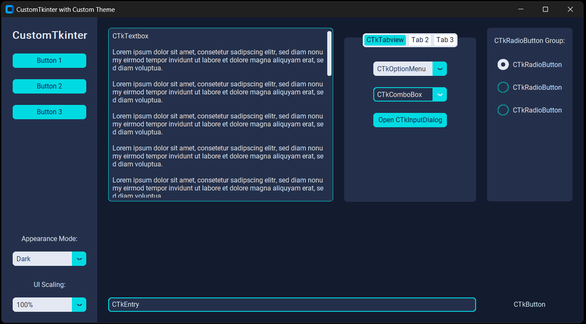

# CustomTkinter Theme Project

This project demonstrates the use of a custom theme with CustomTkinter, a modern and fully customizable tkinter-based UI library for Python.



## Features

- Custom dark theme with a blue accent color
- Sidebar with navigation buttons
- Main content area with various CustomTkinter widgets
- Appearance mode switcher (Light/Dark/System)
- UI scaling options

## Requirements

- Python 3.7+
- CustomTkinter 5.1.2+

For a complete list of dependencies, see `requirements.txt`.

## Installation

1. Clone this repository:
   ```
   git clone git remote add origin https://github.com/Nakxa/custom-tkinter-new-theme.git
   ```

2. Navigate to the project directory:
   ```
   cd custom-tkinter-new-theme
   ```

3. Install the required packages:
   ```
   pip install -r requirements.txt
   ```

## Usage

Run the main script to start the application:

```
python main.py
```

## Custom Theme

The custom theme is defined in `custom_theme.json`. You can modify this file to adjust colors, fonts, and other UI elements to suit your preferences.

## Contributing

Contributions are welcome! Please feel free to submit a Pull Request.

## License

This project is open source and available under the [MIT License](LICENSE).
